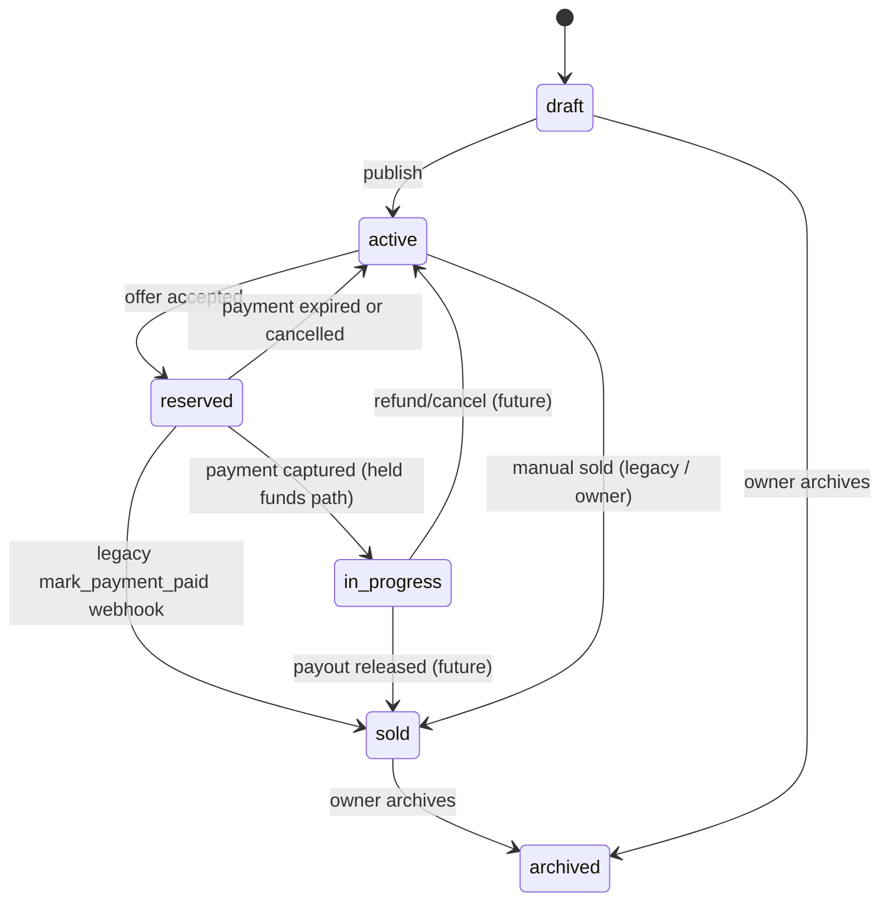

# Equipd payments architecture (Phase 3a — held funds foundation)

Database foundation for **separate charge + delayed transfer** marketplace payments. Checkout, buyer confirmation UI, and payout release are not fully wired yet.

## Listing lifecycle

| Status | Meaning |
|--------|---------|
| `draft` | Seller editing, not visible on browse |
| `active` | Published, open to offers |
| `reserved` | Offer accepted; buyer has 3 days to pay |
| `in_progress` | Buyer paid; funds held on platform; fulfilment in progress |
| `sold` | Transaction complete (legacy webhook or future payout release) |
| `archived` | Removed from marketplace |

## Payment vs order

| Table | Role |
|-------|------|
| `payments` | Buyer charge lifecycle (Checkout, capture, refund) |
| `orders` | Marketplace transaction: fulfilment + seller payout lifecycle |

One accepted offer → one `payments` row → one `orders` row (1:1).

## Payment statuses (`payments.status`)

| Status | Meaning |
|--------|---------|
| `pending` | Awaiting buyer Checkout (always set on new acceptances) |
| `paid` | Buyer charge captured |
| `expired` | 3-day window passed without payment |
| `cancelled` | Cancelled before capture |
| `refunded` | Refunded (future) |
| `awaiting_seller_setup` | **Legacy only** — migrated to `pending` in Phase 3a |

## Order fulfilment statuses (`orders.fulfilment_status`)

| Status | Meaning |
|--------|---------|
| `awaiting_payment` | Offer accepted, buyer has not paid |
| `paid` | Buyer paid; funds held (held-funds path) |
| `in_progress` | Fulfilment underway (future use) |
| `buyer_confirmed` | Buyer confirmed receipt (future) |
| `completed` | Transaction complete |
| `cancelled` | Order cancelled |
| `disputed` | Dispute (future) |

## Payout statuses (`orders.payout_status`)

| Status | Meaning |
|--------|---------|
| `not_due` | Buyer has not paid, or payout not yet eligible |
| `awaiting_seller_setup` | Payout blocked until seller completes Connect (future) |
| `ready` | Eligible for transfer (future) |
| `processing` | Transfer initiated (future) |
| `paid` | Seller paid out |
| `failed` | Transfer failed (future) |
| `cancelled` | Payout cancelled |

Platform fee: stored on `payments` / `orders` as `platform_fee_pence` (default **0%**). Seller receives `seller_net_pence = amount_pence - platform_fee_pence`.

## RPCs (service role)

| RPC | Purpose |
|-----|---------|
| `accept_offer()` | Reserve listing + create `payments` + `orders` (payment always `pending`) |
| `mark_payment_captured()` | **Held funds path** — payment `paid`, order `paid`, listing `in_progress` |
| `mark_payment_paid()` | **Legacy path** — payment `paid`, order `completed`, listing `sold` (current webhook) |
| `expire_payment()` / `cancel_payment()` | Sync payment + order + listing |
| `attach_checkout_session()` | Store Checkout Session id before redirect |

## Current webhook

`stripe-webhook` calls **`mark_payment_captured()`** on `checkout.session.completed` (Phase 3b). Funds stay on the Equipd platform balance; listing moves to **`in_progress`**, not **`sold`**.

`mark_payment_paid()` remains in the database for legacy rows only.

## Hub sections (unchanged for now)

| Section | Data rule |
|---------|-----------|
| **Accepted offers I made** | Accepted + payment not `paid` |
| **Purchased items** | Payment `paid` |
| **Sold items** | Listing `sold` |

Listings in `in_progress` appear under **My listings** for sellers.
